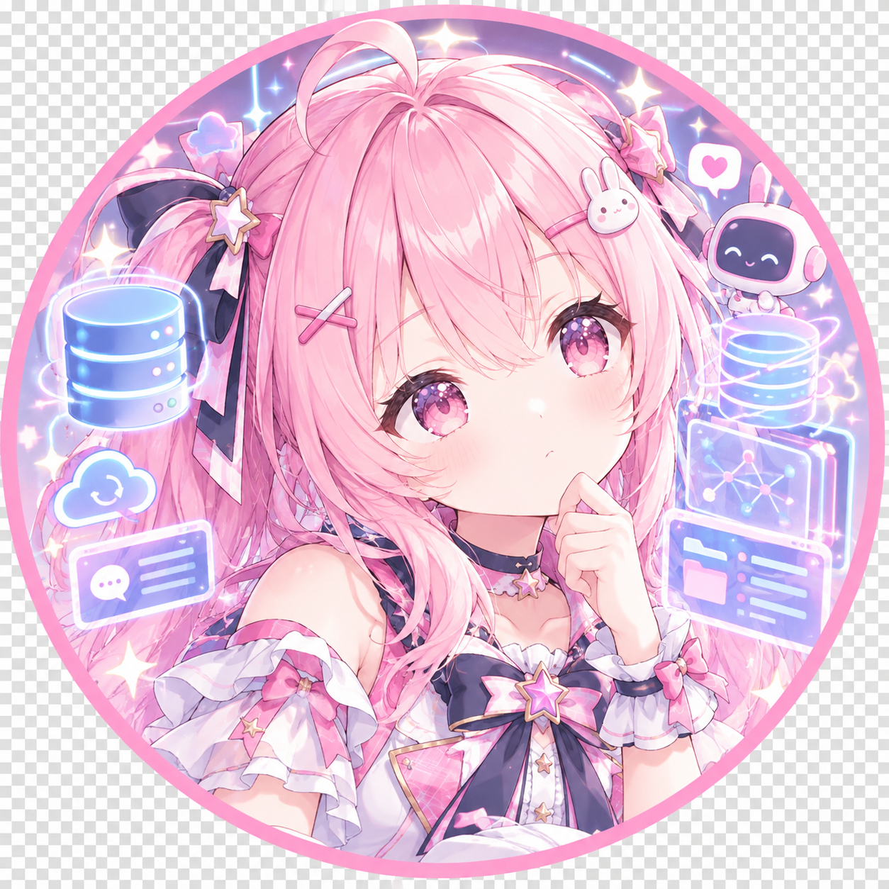

# MemoryForge · 铸忆

  

[**AstrBot**](https://github.com/AstrBotDevs/AstrBot) 的长期记忆插件：自动积累用户画像，并在对话前按需注入，让机器人在多轮、跨会话、跨平台下持续"记得你"。

## 它能做什么

- **记住用户**：从日常对话中沉淀偏好、事实、习惯、约束与沟通风格，形成以用户为中心的长期画像。
- **按需回忆**：回复前自动注入相关画像，无需额外配置，也不额外调用模型。
- **主动记忆**：模型可通过 `remember` / `recall` 工具主动保存与检索记忆。
- **跨平台同一人**：可把同一用户在不同平台/账号下绑定为同一人，共享一份记忆。
- **可管理**：支持强化、衰减、固定、合并、拆分、提纯、失活，以及可选的记忆管理面板。

## 安装

1. 在 AstrBot 插件市场安装，或克隆本仓库到 AstrBot 的插件目录。
2. 在 AstrBot WebUI 启用插件；默认配置即可开始自动采集与注入。
3. 对话累计到阈值后，后台自动沉淀画像（管理员亦可手动触发）。

## 常用配置

- **Embedding（建议配置）**：先在 AstrBot「模型」中配好 Embedding Provider，再在插件「向量检索」中选择它。开启向量混合召回可提升相关性；未配置时自动退回关键词检索。
- **写入模式** `memory_mode`：`hybrid`（默认，自动沉淀 + 主动记忆）、`distill_only`（仅自动沉淀）、`active_only`（仅主动记忆）。
- **成本控制**：可设置每日蒸馏上限与批大小，超出自动降级。

## 使用

管理命令（需 AstrBot `ADMIN` 权限）：

| 命令 | 说明 |
|------|------|
| `/tm_memory` | 查看当前用户记忆 |
| `/tm_context <问题>` | 预览将被召回的内容 |
| `/tm_distill_now` | 立即触发一次蒸馏 |
| `/tm_stats` / `/tm_distill_history` | 统计与成本 |
| `/tm_mem_merge` / `/tm_mem_split` / `/tm_forget` / `/tm_pin` | 记忆整理 |
| `/tm_export` / `/tm_purge` | 导出 / 清除 |
| `/tm_bind` / `/tm_merge` | 账号绑定与记忆合并 |

模型工具：`remember`（保存）、`recall`（检索）。

## 隐私与安全

- 只沉淀结构化的"派生画像"，不含密钥等敏感信息。
- **群聊默认不注入私聊记忆**；如需群聊召回须显式开启，并自行评估隐私风险。

## 兼容性

- AstrBot `>=4.16,<5`；支持主流适配器。
- 向量检索为可选增强，环境不满足时自动降级，不影响使用。

## 许可

GNU AGPL-3.0（见 [`LICENSE`](./LICENSE)）。版本与变更历史见 [`CHANGELOG.md`](./CHANGELOG.md)。
